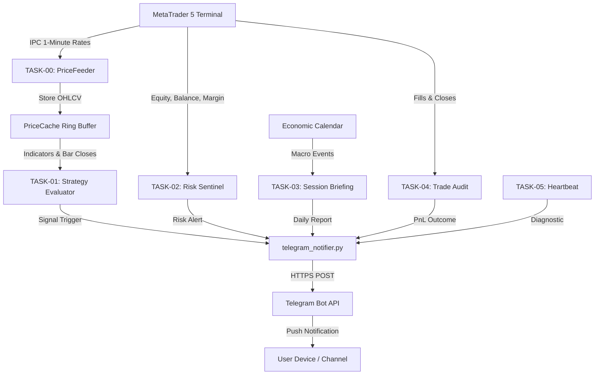

# J.A.R.V.I.S. Core Tasks & Architectural Blueprint

This document outlines the core task modules for J.A.R.V.I.S., their execution cycles, inputs, and outputs.

---

## 1. Task Roster & Execution Matrix

| Task ID | Module | Trigger / Schedule | Input Source | Output Action |
| :--- | :--- | :--- | :--- | :--- |
| **TASK-00** | `MT5 1-Minute Price Feeder` | Top-of-minute loop (:00) | MetaTrader 5 Terminal | In-memory `PriceCache` & `on_bar_close` event |
| **TASK-01** | `Signal Dispatcher` | Real-time event / M1 close | PriceCache / Strategy Engine | Formatted TG Signal Alert (`📈 / 📉`) |
| **TASK-02** | `Risk Sentinel` | Continuous polling / Per trade | Account balance / Drawdown % | TG Risk Warning / Trading Halt (`🚨`) |
| **TASK-03** | `Session Briefing` | Fixed Cron (e.g. London / NY Open) | Calendar API / Balance summary | TG Market Briefing (`🌐`) |
| **TASK-04** | `Trade Journal & Audit` | On Position Close | Broker History API | TG PnL Notification + Local CSV/JSON Log |
| **TASK-05** | `System Heartbeat` | Hourly Cron | API Ping / Connectivity status | TG Health Status (`⚙️`) |

---

## 2. Data Flow Architecture

---

## 3. Portability Checklist

When transferring this workspace to another server, VPS, or cloud container:
- [ ] Python 3.8+ installed (zero mandatory external dependencies; standard library `urllib` is supported out-of-the-box).
- [ ] `.agents/skills/trading-jarvis/` folder present in workspace root.
- [ ] `TELEGRAM_BOT_TOKEN` and `TELEGRAM_CHAT_ID` set in `.env` or `telegram_config.json`.
- [ ] Connectivity verified via `python .agents/skills/trading-jarvis/scripts/test_alert.py`.
